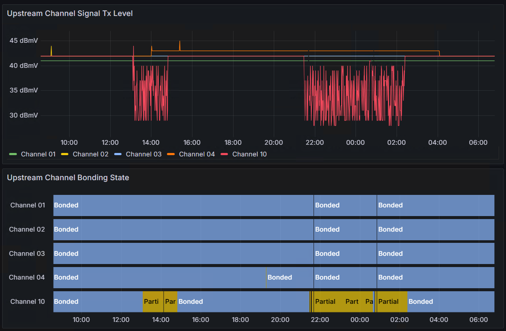

# Modem Signal Level Scraper

## Introduction

This project reads the signal levels from a Technicolor TC4400 modem
and scrapes the metrics into Prometheus for display in Grafana,
in order to help identify intermittent connectivity issues.

Everything you need to collect and visualize the data is provided "out of the box"
via Docker Compose.

For example, here is the dashboard revealing an issue occassionally hitting Channel 5:



## Prerequisites

- A Docker Compose runtime, such as [Rancher Desktop](https://rancherdesktop.io/)
- A [Technicolor TC4400 Cable Modem](https://www.canadacomputers.com/product_info.php?cPath=27_1059&item_id=231043&language=en)

## Getting Started

If you have a passing familiarity with running Docker Compose or containers in general,
then you should be able to have this project up and running in just a few moments.

All example commands are run from the root of the repository.

### Get your modem's credentials

The modem has a password-protected Web UI which this tool will scrape.

The credentials are set by your ISP,
and can be found online with some ease.

These links may help:

- [Reddit discussion for TekSavvy](https://old.reddit.com/r/teksavvy/comments/j283mt/cant_access_tc4400_admin_page/)

Verify that you can log into the Modem's Administrative Web UI with your browser.

The default address for the Modem's Web UI is [http://192.168.100.1](http://192.168.100.1).

If you are unable to login,
then it is unlikely that this tool will be any more successful.

### Clone this repository

You need to run the project locally,
so clone this repository anywhere you like on your computer.

```sh
$ git clone https://github.com/kabourneeak/modemscraper.git
```

### Configure modem password

You will need to configure the tool with the modem password you found above.
You must create a `scraper.env` file next to the `compose.yaml`
with the correct environment variable and value,
which you can do with the following command:

```sh
$ cat << EOF > scraper.env
MODEM__TC4400__PASSWORD=the-password
EOF
```

### Start for the first time

Use these commands to build the project,
startup the services,
and start scraping data.

```sh
$ docker compose build
[+] Building 0.0s (0/0)  docker:default
[+] Building 0.9s (32/32) FINISHED     

$ docker compose up -d
[+] Running 6/6
 ✔ Network netstats_scraping_network     Created
 ✔ Volume "netstats_grafana-storage"     Created
 ✔ Volume "netstats_prometheus-storage"  Created
 ✔ Container prometheus                  Started
 ✔ Container scraper                     Started     
 ✔ Container grafana                     Started
```

### Observe

Once running, use these links to see what the project is up to.

- [Connection Status Dashboard in Grafana](http://localhost:3000/d/edttjjhaqguf4b/connection-status?orgId=1)
  - This is almost certainly the main thing you want to look at.
  - Note that it can take about a minute for data to start appearing here.
    If all the dashboard panels say "No Data" just wait a bit longer.
- [Your TC4400 modem](http://192.168.100.1)
  - The default address for the modem's in-built Web UI.
  - The [Connection Status](http://192.168.100.1/cmconnectionstatus.html) page that the scraper is scraping.
- [Prometheus](http://localhost:9090)
  - The underlying database for the scraped data.
- [Scraper](http://localhost:8080/metrics)
  - The scraping tool itself.

### Stop

To stop all services, use the following command:

```sh
docker compose stop
```

New data will not be scraped,
and you will not be able to access the dashboards,
however, previously scraped data will remain stored until you restart it.

### Restart

Use this command if you have already been running this project,
already have scraped data,
and just want to continue scraping
or review the dashboards.

```sh
docker compose start -d
```

### Remove all data

If you are done with this tool,
use the following command to remove all stored data:

```sh
docker compose down -v
```

This will remove all scraped data.
In particular, it will remove the Docker volumes associated with Grafana and Prometheus.

## Why?

This project was created to help gather data about intermittent Internet connectivity issues.

Generally, unless your internet is down _while_ you are on the phone with your ISP,
there is little they can do to help beyond asking you to restart your house.
This issue can be compounded with reseller ISPs (e.g., TekSavvy)
because the actual network operators (e.g., Rogers) seem to place such service calls
at the back of their work queue.

Some hard data can help your support agent understand the problem better,
corroborate patterns with other customers,
and escalate your case appropriately.

Other tools to help:

- [Packetlosstest.com](https://packetlosstest.com/)
- [Wireshark](https://www.wireshark.org/)

## Dev notes

To set up User Secrets

```sh
$ dotnet user-secrets -p src/scraper set "Modem:TC4400:Password" "the-password"
```
